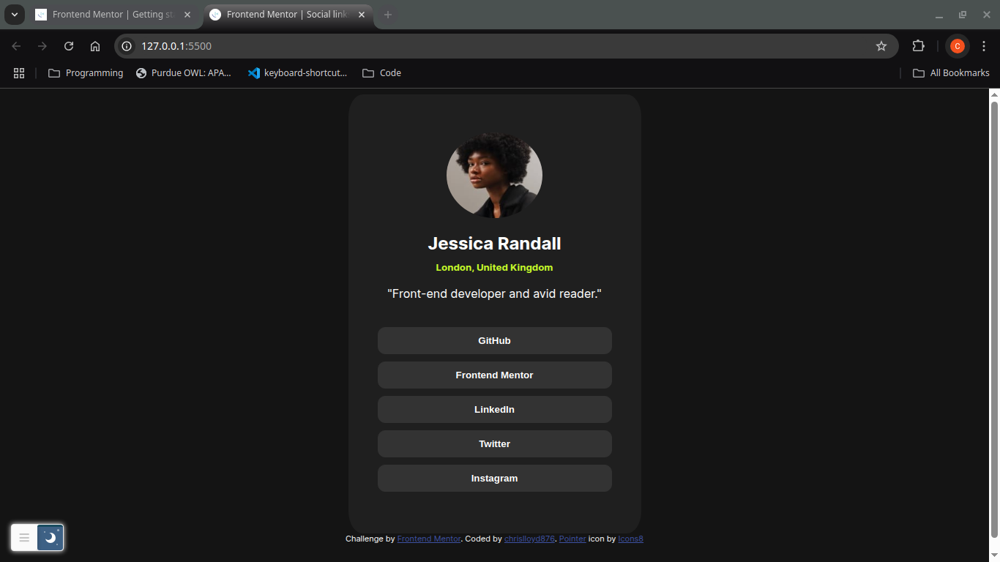

# Frontend Mentor - Social links profile solution

This is a solution to the [Social links profile challenge on Frontend Mentor](https://www.frontendmentor.io/challenges/social-links-profile-UG32l9m6dQ). Frontend Mentor challenges help you improve your coding skills by building realistic projects. 

## Table of contents

- [Overview](#overview)
  - [The challenge](#the-challenge)
  - [Screenshot](#screenshot)
  - [Links](#links)
  - [Built with](#built-with)
  - [What I learned](#what-i-learned)
  - [Useful resources](#useful-resources)
- [Author](#author)

**Note: Delete this note and update the table of contents based on what sections you keep.**

## Overview

### The challenge

Users should be able to:

- See hover and focus states for all interactive elements on the page

### Screenshot



### Links

- Solution URL: https://github.com/chrislloyd876/social-links-profile
- Live Site URL: https://chrislloyd876.github.io/social-links-profile/


### Built with

- Semantic HTML5 markup
- CSS custom properties
- Flexbox
- [w3schools](https://www.w3schools.com/) - for hover and styles


### What I learned

I learned how to use chaining selectors to make editing easier for multiple elements. I also learned how to use hover for more responsive interaction.

```css chaining selectors
main, .info, .links{
    display: flex;
    flex-direction: column;
    align-items: center;
}

```css button interaction
button:hover{
    background-color: hsl(75, 94%, 57%);
    color: hsl(0, 0%, 8%);
    cursor: url('assets/images/icon.png'), auto;

}
```

### Useful resources

- [w3schools hover](https://www.w3schools.com/cssref/sel_hover.php) - This helped me for creating the interaction with the buttons. I really liked this pattern and will use it going forward.
-

## Author

- Frontend Mentor - [@yourusername](https://www.frontendmentor.io/profile/yourusername)